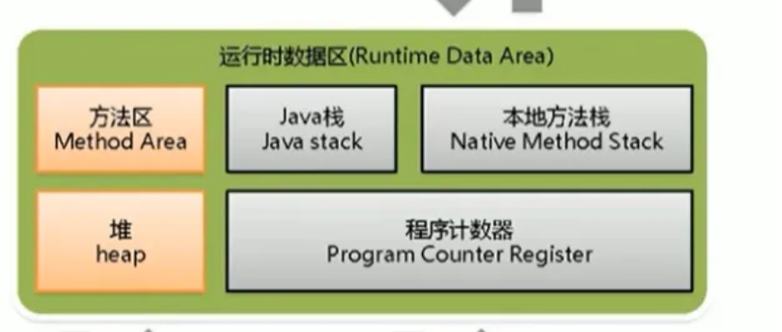

# JAVA八股（恼

## 基础：

### 面向对象：

封装、继承、多态。

### jdk8特性

- 引入lambda表达式，以更紧凑的方式定义匿名函数。
- 引入流（stream），用于处理数据集合，提供了丰富的操作。
- 引入了java.time包，提供了全新的日期和时间处理功能。
- 并行流，允许在多核处理器上高效的处理并行数据。

### 抽象类和接口类

- 定义
  - 抽象类是一个类，可以有抽象方法和具体方法，可以有普通的字段、构造方法等
  - 接口只包含抽象方法和抽象字段，无构造方法，也没有具体方法。
- 继承
  - 子类通过继承获得父类的属性和方法，一个类只能继承一个抽象类，可以选择性的覆盖抽象方法。
  - 类可以实现多个接口，必须提供接口中的所有抽象方法的具体实现。
- 构造函数
- 字段
- 多态性
  - 单继承，是‘is-a’
  - 接口是多继承的，是‘has-a’

### 接口类中可以写具体的方法吗？

可以！

在JDK8之后，引入了默认方法（default methods）和静态方法（static methods），允许在接口中包含具体的方法实现，可以被接口的类继承或直接调用。

### instanceof

用来测试一个对象是否是一个类的实例。

~~~java
boolean result = obj instanceof class;
~~~

如果obj为class的对象or子类，接口的实现类，为true

### 自动装箱和拆箱

装：

~~~java
Integer integer = Integer.valueOf(1);
~~~

拆箱：

~~~java
int in = integer.intValue();
~~~

### String StringBuffer StringBuilder

String:

~~~java
private final char value[];
~~~

StringBuffer StringBuilder:

都继承了AbstractStringBuilder抽象类

### HashMap HashTable

**父类不同**

**对外提供接口不同**

hashtable多了elements()和contains()

**对null的支持不同**

**安全性不同**

### java中的引用方式

- 强引用

  - 默认的引用类型，可以阻止对象被GC回收，只有当没有强引用指向一个对象时，才会回收它。

  ~~~java
  Object obj = new Object();
  ~~~

- 弱引用

  - 是一个非必须的对象，会在下一次垃圾回收时，即使内存充足也会被回收。

  ~~~java
  WeakReference<Object> weakRef = new WeakReference(new Object());
  Object o = weakRef.get();
  ~~~

- 软引用

  - 有用但是非必须的对象，会在内存不足的GC时回收。

  ~~~java
  SoftReference<Object> softRef = new SoftReference(new Object());
  Object o = softRef.get();
  ~~~

- 虚引用

  - 本身不阻止GC对其的回收，也一般不使用get方法来获得这个这个类，
  - 一般需要通过 `PhantomReference` 类来实现，也与 `ReferenceQueue` 一起使用，以便在对象被回收时接收通知。

  ~~~java
  //创建对象并关联队列
  Object obj = new Object();
  RefereceQueue<Object> ref = new ReferenceQueue<>();
  PhantomReference<Object> pha = new PhantomReference<>(obj,ref);
  
  obj = null;
  
  //GC
  System.gc();
  
   // 检查引用队列，查看虚引用是否已被加入
  PhantomReference<Object> queuedRef = (PhantomReference<Object>) referenceQueue.poll();
  if (queuedRef != null) {
      System.out.println("虚引用对象已被回收");
  } else {
      System.out.println("虚引用对象未被回收");
  }
  ~~~

  

### final

类不可被继承

方法不可被重写

变量不可被改变

被修饰的方法JVM会将其内联以提高效率

被修饰的常量在编译阶段会存入常量池。

### Exception

#### RuntimeException

不会被检查，即没有trycatch也会通过编译。

除数为0的ArithmeticException

数组越界产生的IndexOutOfBoundsException

fail-fast产生的ConcurrentModificationException。

类转换异常ClassCastException

NullPointerException

BufferOverflowException

#### Exception中除了RuntimeException的部分

会被检查。

IOException

FileNotFoundException

SQLException

#### Error

不会检查

资源不足、约束失败、或是其他程序无法运行的情况就产生错误。

### OOM

OutOfMemory

#### java heap溢出（java.lang.OutOfMemoryError:java heap spacess）

java堆用于存储对象实例，不断创建对象，并且保证GC roots到对象之间有可达路径，避免垃圾回收机制回收对象，就会爆OOM

一般先对dump出的堆转存快照分析（visual VM），查看是内存泄漏还是内存溢出。

##### 内存泄漏

查看泄露对象到GC roots的引用链，查看怎样的路径与GCroots相连导致无法回收。

##### 内存溢出

检查代码，查看JVM参数

-Xms JVM启动时堆内存的初始大小 -Xms512m

-Xmx 堆内存的最大大小 -Xmx1024m

#### 常量池溢出（java.lang.OutOfMemoryError:heap）

向运行时常量池添加数据：

~~~java
String.intern(); //native方法
~~~

如果池中已有一个等于它的字符，返回这个对象，如果没有，新增一个字符进常量池。

使用了太多的String，尝试使用StringBuffer代替

使用了太多的常量，例如整数、浮点数等等。

动态生成了太多的类名、字段名，等等。

JVM：因为常量存储在永久代（java6之前）或元空间（java7之后）

所以直接调节永久代的大小。

永久代：

~~~cmd
-XX:PermSize
~~~

~~~cmd
-XX:MaxPermSize
~~~

元空间：

~~~cmd
-XX:MaxMetaspaceSize=256m
~~~

#### 方法区溢出（java.lang.OOM:PermGenspace）

方法区存储class的元数据信息，例如类名，访问修饰符，常量池，字段描述，方法描述等。

可能是大量动态生成class

#### SOF

StackOverFlow：堆栈溢出。

原因：递归调用，死循环或大量循环，全局变量过多，数组、List、map过大。

### 线程 进程 程序

程序：一组指令或代码的集合，只是存储在磁盘上的一段静态代码，没有生命周期。

进程：是程序的运行实例，是操作系统分配资源和管理任务的基本单位，进程是动态的，是有生命周期的。进程之间通常不能直接共享内存，它们之间的通信需要进程间通信（IPC）机制进行。

线程：是一个比进程更小的执行单位，一个进程在执行中可以产生多个线程，并且多个线程共享进程的内存和系统资源，所以系统在线程间切换压力小。

### 进程通信

管道（pipe）

半双工通信方式，父进程和子进程可以通过此传递数据。

消息队列

允许进程通过发送消息来交换数据，进程可以将消息放入队列，然后其他进程可以从队列中接收消息。

信号

进程可以向其他进程发送信号，以触发特定的操作。

共享内存

允许不同进程共享同一块物理区域，以便直接读写共享的数据。

信号量

是一个同步工具，用来保证不同进程以正确的顺序访问资源。

### 序列化

不想序列化，使用transient

### IO流

#### 分为几种？

- 按照流的流向，分为输入流和输出流
- 按照操作单元划分，分为字节流和字符流
- 按照流的角色分为节点流和处理流

#### java IO流的类

- InputStream/Reader: 所有输入流的基类，前者是字节输入流，后者是字符输入流。
- OutputStream/Writer:所有输出流的基类，前者是字节，后者字符。

#### java IO和NIO

New IO jdk1.4引入，NIO主要使用块，效率比IO高。

### java反射

指在程序运行时可以获得这个类的所有属性和方法，对于任意对象，都能够调用它的任意方法。在java中只要给定类的名字，就能够获取类的所有信息。

#### 实现方式

获取class对象

~~~java
Class<?> myClass = Class.forName("com.example.MyClass");
~~~

~~~java
User user = new User();
Class<?> myClass = user.getClass();
~~~

~~~~java
Class<?> myClass = User.class;
~~~~

#### 访问类的信息

~~~java
Field[] fields = myClass.getDeclaredFields();
~~~

#### 实例化一个对象

~~~java
Constructor<?> con = myClass.getConstructor();
Object obj = con.newInstance();
~~~

#### 调用方法

可以用来调用各种公共方法和私有方法，

~~~java
Method method = myClass.getMethod("myMethod", parameterTypes);
Object result = method.invoke(obj, args);
~~~

#### 修改字段值

~~~java
Field field = myClass.getDeclaredField("myField");
field.setAccessible(true); // 可以访问私有字段
field.set(obj, value);
~~~

#### 优缺点：

**优点：**

可以运行时动态获取类的实例，提高灵活性。并且可以与动态编译结合

**缺点：**

- 性能较低，需要解析字节码
- 相对不安全，破坏了封装性。
- 绕过了编译时检查，需要谨慎的处理异常。

#### 为什么性能不好？

- 运行时解析：反射需要在运行时解析类和方法的信息，而不是在编译时。这增加了运行时长的开销，包括方法查找，类型转换等等。
- 类型安全性检查：要做额外的类型安全性检查以保证方法和字段的可用性。
- 方法调用开销：通过反射会更慢，因为它涉及到方法查找和动态方法调用。
- 无法编译时优化：由于反射的特性，编译器无法进行静态分析和优化。

### Object：

#### clone方法：

必须先实现Cloneable接口才能调用，实现对象的浅拷贝。

深拷贝也需要实现Cloneable方法，并且成员变量是引用类型的也需要实现Cloneable方法，再重写clone方法。

#### finalize方法：

在GC已经确定没有对这个对象的引用时，将其销毁，销毁前调用该方法。

已经不推荐使用，原因：

- 执行时间不确定，可能会影响性能
- 可能不执行，不是所有的对象都会被回收。

#### equals方法：

判断相等

#### hashcode：

用于哈希查找，重写了equals就要重写hashcode，因为：`obj1.equals(obj2)`为true，一定可以推出 `obj.hashCode() == obj.hashCode()` 

如果不重写，例如将他们存入hashmap时，查找该元素就会出现问题，因为它会查找hashcode是否对应，可能会查不到equals的那个元素。

#### wait：

需要配合 `synchronized` 使用，使当前的线程等待该对象的锁，当前线程必须拥有该对象，具有该对象的锁，wait方法会一直等待，`wait(long timeout)` 设定超时间隔，超时则返回锁。

调用该方法后当前线程会进入睡眠状态，什么时候唤醒？

- 其他线程调用了该对象的notify方法
- notifyAll方法
- 其他线程interrupt了该进程
- 时间间隔到了

如果被中断会抛出InterruptedException

#### notify

需要配合 `synchronized` 使用

唤醒一个等待队列上的线程。

#### notifyAll

需要配合 `synchronized` 使用

唤醒所有在等待队列上的所有进程。

### java创建对象

new clone 反射 反序列化

### ArrayList

底层使用数组实现，如果增加的数据量很大，应该先使用 `ensureCapacity()` ,先预设ArrayList的大小，可以提高初始化速度。

尽量不使用 `add(int,o)` 添加到指定位置会移动大量的元素。

高并发线程不安全。

实现了cloneable接口，可以复制，但是浅拷贝

### HashMap HashTable

都实现了Map Cloneable Serializable接口

Hashmap继承的是AbstractMap

HashTable继承的是Dictionary

Hashtable是线程安全的，Hashmap不是

Hashtable的key和value都不能为null

HashMap的key可以有一个null，value可以多个

#### Hashmap插入流程

- 计算哈希码：首先对key计算哈希码以确定存放的位置
- 计算桶索引：hashmap中包含一个数组，每个位置有一个桶，通过哈希码计算出来的索引确定了是哪个桶，对桶数量取模确定桶索引。`bucketIndex= hashCode % bucketArray.length` 
- 检查冲突：可能导致哈 希冲突，使用链表或红黑树解决冲突。
- 插入数据：确定了桶索引，现在会将数据加入桶的数据结构中。
- 扩容：当元素数量达到一定百分比（默认0.75）会触发扩容操作，新容量是原来的两倍。扩容后需要有一个从旧桶复制数据到新桶的过程。
- 完成插入：插入完成后，调用get（key）方法，会计算哈希值，查找对应的桶。在桶中查找数据。

### ConcurrentHashMap

#### 数据结构：

使用分段锁实现并发，每个分段是一个小的哈希表，包含多个桶。

每个桶存储一个kv映射条目，桶里以链表或树的形式存冲突的键值对。

#### 实现：

分段锁！多个线程同时访问的时候，每个分段可以独立的进行读取和写入。当进行写操作的时候锁住相关的桶，而不是整个表。

#### 并发级别

在创建时可以指定初始的并发级别，以及负载因子，

高并发就会创建更多的分段，占用更大的内存。

低并发就会创建更少的分段，节省内存。

### HashMap为什么是2的n次方

Hashmap存取效率尽量高，减少哈希碰撞的可能性，每个链表和红黑树长度尽量相等。取余操作中，如果除数是2的幂次，等价于与除数-1的做与操作。

更高效的扩容，扩容只需要改变某些哈希值的高位或低位，而不需要重新计算。

### Hashmap和ConcurrentHashMap

- 都是以kv存储的
- 线程安全
- hashmap 1.8以前是数组+链表 1.8之后是数组+链表+红黑树。（当链中元素大于8，链表变为红黑树
- concurrenthashmap1.8之前是分段锁，1.8之后使用node+cas+synchronized
- hashmap与concurrenthashmap初始大小是16，扩容以两倍扩充。当达到当前数组的0.75就扩容。

### 红黑树

- 是一棵自平衡二叉搜索树
- 节点是黑色或红色
- 根节点是黑色
- 每个叶子节点都是黑色
- 如果一个叶节点是红色，那他的子节点一定为黑色
- 从一个节点到该节点子孙节点的所有路径都包含相同数目黑节点

### 异常处理

- trycatch
- throws 提醒引用该方法的类
- throw 手动抛出异常

## JVM

### 包含哪些部分

- **类加载器** 负责加载java类文件，双亲委派机制发生的地方
- **运行时数据区** jvm的内存管理部分。
- **执行引擎** 负责执行java的字节码指令，包括解释器和即时编译器
- 本地接口（JNI） 与本地库之间的连接交互，与底层交互的桥梁
- 本地方法库 与操作系统相关的本地方法

线程独占部分：栈、本地方法栈、程序计数器

线程共享：堆、方法区

### 运行时数据区

#### java stack

每个线程有自己的stack，会包含自己的方法的调用和执行，调用方法时入栈，方法返回出栈。

一个**栈帧**与一个方法关联，包括局部变量表、动态链接、方法返回地址等。

#### 本地方法栈

本地指：更本地（c++/c）编写的方法。

本地方法栈提供的是与本地方法库连接的接口，其中保存的与javastack类似，包括局部变量和操作数栈等。

可以通过JNI(java native interface )来调用本地方法。

#### 程序计数器：

保存了当前线程正在执行的字节码位置。

每个线程都有自己的程序计数器，从而可以各自独立追踪各自的指令地址

在方法调用时保存方法的返回地址，以便方法返回时能够继续执行调用点的下一条的指令。

#### 方法区

 也叫非堆区，存储已经被虚拟机加载的类信息，常量、静态变量，编译器优化过的代码，1.7之前的永久代和1.8之后的元空间都是方法区的一种实现。

**运行时常量池**也在方法区中，在其中会执行一些字符串拼接、反射等操作。

#### 堆

jvm最大的一块，对所有线程共享，存放对象的实例，所有new出来的对象都在这里，这一块会产生内存碎片，也是GC的作用对象。

### JMM

java memory model 

定义在多线程编程中如何在不同线程之间共享数据以及保证数据的一致性和可见性。

### 类加载与卸载

**加载**：通过类的完全限定名查找字节码文件，创建class对象。

**验证**：文件格式 元数据 字节码 符号引用，保证不会威胁到虚拟机安全

**准备**：进行内存分配，为static修饰的变量分配内存，final的在编译时分配。

**解析**：将常量池中的符号引用替换为直接引用的过程，直接指向目标的指针或者是相对偏移量。

**初始化**：主要完成静态块的执行和静态变量的赋值，只有当对类主动使用才会初始化。

**卸载**：GC的工作。

#### 加载机制：

双亲委派机制

加载的时候先去寻找父类加载器，直到顶层的启动类加载器，父类可以加载就加载父类，否则再加载子类。

Custom ClassLoader -> Application ClassLoader -> Extension ClassLoader -> BootStrap ClassLoader

优点：

- 避免重复加载
- 避免java核心api被篡改

#### GC

**分代回收**

**回收算法**

- 标记-清除

通常从根节点向下递归的遍历所有的对象，标记可到达的对象，将不可达的对象清除。

- 标记-压缩

与标记清除相似，但清除后还会压缩堆内存到一侧，避免太多的内存碎片。

- 复制算法

主要用于新生代，新生代的内存被分为两块，survivor1和survivor2，每次将一块满了的内存复制到另一块去。

- 引用计数法

追踪每个对象的引用数，为0则回收。

### GC 垃圾回收器

回收新生代： 

- Serial：复制算法，标记和清理都是单线程
- PraNew：复制算法，Serial的多线程版本，
- Parallel Scavenge：新生代并行收集器，追求高吞吐量。
- Serial Old：标记-整理算法，单线程收集器
- G1：整代收集器

如果堆不大

选择串行处理器 `-XX:+UseSerialGC`

如果吞吐量优先，对较长时间停顿没有要求，选择并行收集器 `-XX:+UseParallelGC`

对响应时间有要求使用G1 ZGC CMS

`-XX:+UseG1GC`

`-XX:+UseZGC`

### FullGC

什么时候会出现？

- 老年代空间不足，即（Tenured）空间不足，新生代经历了多次复制算法的minorGC仍然存活的进不去了。
- 永久代（元空间）满了，如果加载的反射类、调用的方法较多，，会被占满。

### java对象创建过程

1 首先检查这个指令的参数能否再常量池中找到这个类的符号引用，然后加载这个类。

2 为对象分配内存

3 对除对象头之外的对象内存空间初始化为0

4 对对象头做必要设置

### java对象结构

对象头：1 对象自身的运行数据：哈希码，GC分代年龄，锁标识等；2 指针类型，指向对象的元数据类型（对象是哪一个类的实例）。

实例数据：有效信息。

对齐补充：JVM要求对象起始地址必须是8字节的整数倍。

### 调优参数：

- **堆内存大小设置**：
  - `-Xms<size>`：设置初始堆内存大小。
  - `-Xmx<size>`：设置最大堆内存大小。
- **新生代和老年代大小设置**：
  - `-XX:NewSize=<size>`：设置新生代初始大小。
  - `-XX:MaxNewSize=<size>`：设置新生代最大大小。
  - `-XX:SurvivorRatio=<ratio>`：设置新生代中Eden区和Survivor区的比例。
  - `-XX:NewRatio=<ratio>`：设置新生代和老年代的比例。
- **永久代/元数据区大小设置**（JVM 8之前）：
  - `-XX:PermSize=<size>`：设置永久代初始大小。
  - `-XX:MaxPermSize=<size>`：设置永久代最大大小。
- **元数据区大小设置**（JVM 8及更高版本）：
  - `-XX:MaxMetaspaceSize=<size>`：设置元数据区的最大大小。
- **垃圾回收器选择**：
  - `-XX:+UseParallelGC`：使用并行垃圾回收器。
  - `-XX:+UseConcMarkSweepGC`：使用CMS垃圾回收器。
  - `-XX:+UseG1GC`：使用G1垃圾回收器。
- **GC相关参数**：
  - `-XX:MaxGCPauseMillis=<time>`：设置期望的最大垃圾回收停顿时间。
  - `-XX:GCTimeRatio=<ratio>`：设置垃圾回收时间占总时间的比例。
- **并发垃圾回收**：
  - `-XX:+UseConcMarkSweepGC`：使用CMS垃圾回收器，实现部分并发收集。
  - `-XX:+UseG1GC`：使用G1垃圾回收器，实现更加可控的并发收集。
- **触发Full GC**：
  - `-XX:CMSInitiatingOccupancyFraction=<percent>`：设置CMS垃圾回收器的触发条件。
  - `-XX:MaxGCPauseMillis=<time>`：设置期望的最大垃圾回收停顿时间。
- **内存区域的详细信息**：
  - `-XX:+PrintGCDetails`：输出详细的GC信息。
  - `-XX:+PrintGCDateStamps`：输出GC发生的时间戳。
- **堆转储（Heap Dump）**：
  - `-XX:+HeapDumpOnOutOfMemoryError`：在内存溢出时生成堆转储文件。
- **GC日志**：
  - `-Xloggc:<filename>`：将GC日志输出到指定文件。
- **禁用具体GC类型**：
  - `-XX:-UseParNewGC`：禁用Parallel New收集器。
  - `-XX:-UseParallelOldGC`：禁用Parallel Old收集器。

### 逃逸分析

一些局部对象，如果只在本方法内使用，那么这些对象会被分配在栈上而不是堆上，如果没有逃逸到外部的一个类，有可能被编译器发现，让他在不会被分配在堆上。

### 使用元空间代替永久代

使用`-XX:PermSize=<size>`：设置永久代初始大小。可是总不知道能设置多少合适，使用元空间可以避免这个问题。理论上内存多大元空间就有多大。

### Stop the world OopMap

GC时会涉及对象移动，会停止所有的线程，所以叫STW

**Oopmap**：

一旦类加载完成后，会把对象内的特定偏移量计算出来，记录到oopMap中，在即时编译中也会在特定的位置记录下Oopmap，主要是在：循环末尾、方法返回前，可能抛异常的位置。

这些位置就是safepoint，必须执行到safepoint才能够暂停。

### JVM主要组成部分：

- Class loader（类装载子系统）：类加载系统
- Execution engine（执行引擎子系统）：解释执行、即时编译
- Runtime data area（运行时数据区组件）：运行时数据区
- Native Interface（本地接口组件）：与底层方法的交互

# 多线程

### 线程安全：

线程安全指多线程的环境下，一个共享的资源或数据能够被多个线程同时访问或修改，不会导致错误的结果，即在多个线程同时运行下，运行结果和每个线程依次执行的结果是一致的。

#### 避免的问题：

- 竞态条件：多个线程竞争访问共享资源，最后的结果依赖于执行顺序，可能出现不一样的情况。
- 数据损坏：多个线程同时操作可能造成数据损坏
- 不一致性：可能同一个数据在不同的线程里有不一样的状态，导致程序出现错误。

#### 可以采用的技术：

锁、同步方法、使用线程安全的数据结构、避免共享状态等。 

### 实现多线程的方法

- 继承Thread方法
- 实现Runnable接口
- 实现Callable接口
- 线程池

### CountDownLatch

是一个多线程中的同步辅助工具，用于控制一个或多个线程等待一组操作后再执行。有几个主要的方法

~~~java
public CountDownLatch(int count);//构造方法传入初始值
public void countDown();//用于计数器-1，通常由执行的线程调用
public void await();//等待计数器变为0，如果不为0会被阻塞。
public boolean await(long timeout, TimeUnit unit);//增强的阻塞，最多等待指定时间，如果超时之前计数器变为0返回true，否则返回false。
~~~

### volatile和synchronized有什么区别

- volatile
  - 用于修饰变量，确保多个线程能够正确地读取和修改该变量的值。
  - 当一个变量被声明为volatile时，每次访问该变量都会从主内存中读取，而不是从线程的本地内存，保证了对该变量的操作对所有的线程都可见。
  - 不会造成线程阻塞。
- synchronized
  - 主要用于修饰方法，用于实现临界区的同步，确保同一时间只有一个线程可以访问 `synchronized` 修饰的代码。
  - 提供了互斥锁，防止多个线程同时执行代码块
  - 可能会导致线程阻塞，因为他要等待锁。

### synchronized和lock的区别

- 语法
  - synchronized是java关键字，用于同步代码块或方法，
  - lock是java的接口，需要显式的创建对象的实例，通常使用 `ReentrantLock` 来实现，提供了更灵活的锁定方式，如读写锁、条件等。需要开发者更多的控制。
- 灵活
  - lock方式提供更多的同步方式，例如尝试获取锁，设置超时，可中断等等，也支持创建多个锁对象，允许不同的线程在不同的锁上进行操作。
- 异常处理
  - lock需要自己处理异常，
  - synchronized可以在异常时自动释放锁，但不提供详细的异常处理。
- 可中断
  - lock支持可中断锁，允许一个线程在等待时被打断，`synchronized` 不支持线程的中断操作。
- 总结
  - synchronized更适合相对简单的同步机制，lock更适合复杂的多线程场景。提供了更多、更灵活的关于锁，异常等处理的办法。

### 锁的种类

- 互斥锁： `synchronized` 创建的就是互斥锁，一次只有一个线程能够访问资源，一个线程获得了锁，其他线程都会被阻塞。
- 可重入锁：允许同一个线程多次获取同一个锁，而不会导致死锁。主要用于递归函数、嵌套函数等。 `ReentrantLock` 就是一个可重入锁。
- 读写锁：分读锁和写锁，多个线程都能获得读锁，但只有一个线程有写锁。 `ReentrantwithWriteLock`实现了读写锁。
- 自旋锁：是一种不阻塞的锁，适用于忙等待，而不是让线程直接睡眠状态。

### synchronized底层如何实现加锁

他是依赖于对象监视器或者内部锁来实现加锁解锁的。

关键步骤

- 获取锁：当一个线程进入synchronized代码后，将尝试取得与对象相关联的对象监视器，如果其他线程没有持有锁，那么他就会获得锁，然后继续执行。
- 等待锁：如果锁已经被其他线程持有，那么就会进入等待状态直到锁被释放。
- 释放锁：当线程退出 synchronized中的代码时，他会释放与对象相关联的对象监视器，这会使某一个等待中的线程被唤醒，并尝试获得锁。
- 竞争：如果有多个线程都尝试获得相同对象的锁，就会进入竞争，java虚拟机有公平性策略确保等待时间最长的线程获得锁。

### 对象、锁、对象监视器之间的相互关系

- 对象：是类的实例，包括用户自定义的类和一些内置对象。每个对象都有一个与之相关联的对象监视器，这个监视器用于控制对象的并发访问。
- 锁：是一种用于控制不同线程对共享资源的访问的机制。可以是对象级锁（synchronized）或者是显式的锁lock。是用来确保一个时间只有一个线程可以访问被锁定的资源，避免并发的冲突和数据不一致等等问题。
- 对象监视器：也被称为内部锁。当一个线程想访问对象必须先获得他的对象监视器。如果锁已经被别的线程锁持有，那么进入的线程就会进入阻塞，直到锁释放。

### 乐观锁和悲观锁

- 乐观锁

  - 认为大多数数据不会发生冲突，允许多个线程并行访问资源
  - 使用乐观锁，每个线程首先读取数据，在更新前不会进行加锁操作，线程会记录数据的版本信息，可能是时间戳。
  - 更新数据时，先检查版本信息，如果版本一致，说明没有被修改，线程可以继续，如果版本号不一致，那么需要处理线程冲突。

  优点：允许高并发，适用于读多写少的场景。

- 悲观锁

  - 认为访问共享资源前，其他线程可能会修改数据，所以需要加锁来保护
  - 使用悲观锁需要线程先获取锁，确保其他线程无法访问相同资源。
  - 引入了阻塞，一个线程执行操作，其他线程必须要等待。

  优点：确保数据一致性，适用于数据一致性场合高或写多读少。

### 公平锁和非公平锁

- 公平锁：会按照线程加入等待队列的顺序来获取锁，即先到先得，不会有线程被无限期的阻塞，陷入饥饿状态。
- 非公平锁：不考虑线程加入的顺序，允许新来的线程在等待队列为空时直接获取锁，可能会导致某些线程长时间等待。
  - 公平锁适合确保线程按照先后顺序获取锁的情况；非公平锁在某些情况可能性能更好。	

### CAS

用于多线程编程和并发控制的原子操作，操作并发环境下实现数据的安全更新，

- 比较：比较当前共享数据的值与期望的值
- 交换：如果当前共享数据的值与期望的值相等，CAS会将一个新的值替换到共享数据中。
- 返回结果：CAS操作会返回操作之前的旧值。

### ThreadLocal

可以理解为本地线程变量，在每个线程都创建一个副本，那么线程之间访问内部副本变量就可以，做到了线程隔离，相比`Synchronized` 多花空间少花时间。

#### 如何存储

- 数据隔离：每个Threadlocal都可以独立的访问或修改自己的Threadlocal变量。
- 实现原理：内部使用了一个 `ThreadlocalMap` ，该map中的k是threadlocal对象，值是线程的特定数据，每个线程都有自己的 `ThreadlocalMap` 用于存储自己的局部数据。
- 初始值：可以为每一个Threadlocal分配一个初始值，当线程首次访问的时候如果没有分配值，就赋给它初始值。
- 内存泄漏风险：很可能有内存泄漏的风险，如果没有调用remove方法，数据会一直存储在 `ThreadlocalMap` 中。

#### ThreadlocalMap如果遇到冲突如何解决

- 线程私有：每个线程都有自己的map，不会互相干扰。
- 内部：Threadlocalmap内部使用数组，每个threadlocal对象都有一个唯一的索引，通过这个索引可以定位对应的数据。
- 线性探测：如果多个 `Threadlocal` 对象的索引发生冲突，会使用线性探测，找到下一个可用的存放位置。
- 数据不共享：每个`Threadlocal` 对象只能访问自己设置的数据，无法访问其他threadlocal的数据，因为 `threadlocalmap` 是依靠键来区分数据的。
- 

### 线程池原理，核心参数

1 最大线程数 `maximumPoolSize`

2 核心线程数 `corePoolSize`

3 活跃时间 `keepAliveTime`

4 阻塞队列 `workQueue`

5 拒绝策略 `RefectedExecutionHandler`

#### 执行流程：

- 提交任务，线程池根据corePoolSize创建若干线程执行任务
- 超过corePoolSize后，后续的任务将会进入到阻塞队列进行排队
- 阻塞队列满了后，会创建maximumPoolSize-corePoolSize个额外线程来执行任务，如果任务完成，会将这部分线程销毁
- 如果达到maximumPoolSize后阻塞队列还是满的状态，那么将根据不同的拒绝策略进行处理。

#### 拒绝策略

- AbortPolicy：直接丢弃，抛异常
- CallerRunsPolicy：只用调用者所在的线程来处理任务
- DiscardOldestPolicy：丢弃等待队列中最旧的任务，并执行当前任务
- DiscardPolicy：直接丢弃，不抛异常。

#### 创建线程池的办法

- 关键的包

~~~java
import java.util.concurrent.ExecutorService;
import java.util.concurrent.Executors;
~~~

- 创建线程池

  - 固定大小线程池

  ~~~java
  ExecutorService executor = Executors.newFixedThreadPool(5);
  ~~~

  - 单线程池

  ~~~java
  ExecutorService executor = Executors.newSingleThreadExecutor();
  ~~~

- 提交任务

  ~~~java
  executor.submit(new RunnableTask());
  ~~~

- 关闭线程池

  ~~~java
  executor.shutdown(); //平稳关闭线程池
  executor.shutdownNow(); //立即关闭线程池
  ~~~

  

### wait和block sleep

- wait是Object的方法，使一个线程进入等待，直到其他线程通知它可以继续执行，调用wait方法会释放当前线程的锁，要使用notify或notifyAll来唤醒
- block指线程的阻塞状态，可能会因为IO、等待获取锁、等原因进入阻塞，而不单单是wait。
- sleep只是让线程等待一段时间再执行，不释放锁。

### 死锁的四个条件

- 资源互斥：一个资源只能被一个进程使用
- 一个进程因请求资源而保持阻塞时，不释放已有资源
- 不剥夺：进程已获得的资源在未使用完之前，不能剥夺
- 循环等待

### 解决死锁的几个方面

- **资源分配策略**
  - 通过在请求资源之前检查资源的可用性，避免分配资源给可能导致死锁的进程。
  - 银行家算法
- **资源释放策略**
  - 资源回滚：当出现死锁时，回滚某个进程的资源，释放资源，然后允许该进程重新申请资源
  - 资源剥夺：出现死锁时，系统会抢占资源，一般是根据优先级，然后再次分配该资源。
- **超时机制**
  - 设定等待超时：为资源等待设定最大时间，超过时间，就放弃已占有的资源。
  - 定期检查死锁：定期检查是否存在死锁，如果发现死锁，就释放一部分资源。
- **资源分级**
  - 为进程和资源分配优先级，确保高优先级的请求可以请求到，高优先级的资源也能够使用。
- **避免死锁**
  - 避免使用共享资源：尽量避免使用共享资源。
  - 并发控制：使用信号量、互斥锁等来保证资源的互斥访问。
- **死锁检测和恢复**
  - 检测死锁，一旦检测到，就终止某些进程，或实行回滚。

# Spring

一个java企业级开源开发框架，主要用来开发java应用，有些扩展时用来构建web应用

### 为什么使用？

轻量级

IOC：实现了松散耦合，对象给出他们的依赖，而不去自己创建或查找依赖的对象。

AOP：支持面向切面编程，并且业务逻辑与系统服务分开。

容器：Spring包含并管理对象的生命周期和配置

MVC：

事务管理：持续的事务管理接口

异常处理：把具体别的技术相关的异常转化为一致的unchecked异常。

### Autowired和Resource

#### 相同：

都可以写在字段和setter上

#### 不同：

- Autowired是spring的注解，只按照bytype注入
- 如果想byName注入，需要配合 `@Qualifier("xxxx")` 使用
- Resource是j2ee的注解
  - 默认按照byName注入，如果找不到会按照byType注入。

### 事务的三要素有哪些？

- 数据源：表示具体的事务性资源，是事务的管理者，如MySQL
- 事务管理器：从整体上管理事务的处理过程，如打开、提交、回滚等
- 事务应用和属性配置：一个标识符，表明哪些方法要参加事务，如何参加，以及一些属性如隔离级别，超时时间等。

### 依赖注入

#### 构造器注入

构造函数的参数注入，在初始化时侯注入

#### set方法注入

调用成员变量的setter函数来将被依赖对象注入给依赖类。

#### 注解

加注解，！！

### MVC

- controller
  - 和用户交互
  - 调用业务类
  - 返回页面给用户
- model
  - service
  - dao
  - entity
- view
  - 视图渲染

### SpringMVC

- DispatchServlet
  - 核心组件，是SpringMVC的中央处理器
  - 请求 HandlerMapping，获取一个Handler
  - 请求HandlerAdapter执行该Handler，返回一个modelAndView
  - 请求视图解析器（ViewResolver）解析成真正的视图。
  - 渲染视图，将model转化成response传给view

#### 常用的注解

`@RequestMapping` 用于处理请求的url映射的注解，可用于类或方法上。

`@Requestbody` 接收http请求的json数据，将json转化为java 对象

`@ResponseBody` 将controller方法返回对象转化为json对象相应给用户

### Spring的过滤器和拦截器

- 位置不同
  - 过滤器是在servlet容器级别的，位于进入servlet之前和离开之后，所以用于实现全局的功能，如日志记录、字符编码转换。
  - 拦截器在SpringMVC内部，位于进入Controller之前和离开之后，用于实现特定的业务。
- 依赖框架
  - 过滤器是servlet的一部分
  - 拦截器是Spring MVC的一部分，只能在MVC中使用
- 配置方式
  - 过滤器主要配置在web.xml中
  - 拦截器配置在spring中
- 功能
  - 过滤器实现全局功能，如身份验证，安全性，日志记录，字符编码转换等。
  - 拦截器实现具体业务，如权限验证，参数预处理等

### Spring AOP

- 切点：
  - 定义哪里需要使用通知。
- 通知
  - 是切面中的具体行为，定义了切面在何时执行某些操作。
- 连接点
  - 应用程序中可以应用通知的点，通常是方法的执行点。

### Springboot

#### 核心注解：

- `@Configuration` ：标识该类是一个配置类
- `@EnableAutoConfiguration` ：启动springboot的自动装配机制，
- `@ComponentScan` 启用注解扫描，会扫描指定包下的组件。

# MYSQL

### MVCC

多版本并发控制，用来解决读-写冲突的无锁并发控制。也就是为事务分配单向增长的时间戳，为每个修改保存一个版本。版本与事务时间戳相关联，读操作现在不直接面对数据库，而是读最近的一个快照，这样不用阻塞操作，还可以避免脏读和不可重复读。

#### 实现原理：

主要依赖记录中的三个隐藏字段，undo日志，readView实现的

### 锁

- 共享锁
  - 不堵塞，多个用户可以同时读取一个资源，无影响。
- 排他锁
  - 一个写操作阻塞其他的读锁和写锁，只允许一个用户写入。
- 表锁
  - 系统开销最小，会锁定整张表，myisam使用该锁。
- 行锁
  - 容易出现死锁，发生冲突概率低，并发高，InnoDB使用该锁（要有索引，否则会锁全表）

#### 锁升级

- MySQL行锁只能加在索引上，如果操作不走索引就会升级成表锁。
- 当非唯一索引上记录数超过一定数量时，行锁就会升级成表锁。

### 索引失效的情况：

- 不符合索引顺序的查询条件：如索引是（lastname,firstname）而查询条件是 `WHERE firstname=‘121’` 索引会失效。
- 对列进行了函数操作：在查询中使用函数操作如 `WHERE UPPER(column) =  'VALUE'` 索引就不会被使用。
- 使用OR条件：用OR连接多个字句可能会失效，因为OR两侧可能需要不同的索引
- 数据分布不均匀：如果分布不均匀，某些索引值频率很高，某些很少出现，那对于出现频率高的值，索引可能会失效，因为此时可能全盘扫描更高效。
- 小表：对于小表，使用索引比不使用更慢。
- 数据类型不匹配：查询中的数据类型和索引列的数据类型不匹配，索引可能会失效。如索引是字符串，字句中是int

### Explain：

用于分析查询语句的执行计划，帮助开发人员优化查询性能。

- 查询的执行顺序：显示查询的执行顺序，包括哪些表将被访问，以及它们之间的关系。
- 索引使用：显示哪些表用于加速查询，以及如何使用这些索引。
- 表扫描类型：提供表扫描类型的信息，如全盘扫描、索引扫描、范围扫描等。有助于估计了解查询的效率
- 行数估计：给出每个表的预估行数，对于了解查询的性能和资源需求很有帮助。
- 连接顺序：显示了表之间的连接顺序，这对于多表查询非常重要，因为不同的连接顺序可能会影响性能。

# 网络

### HTTP 

#### HTTP/1.0和HTTP/2.0

- 连接复用
  - 1.0默认使用短链接，每进行一次HTTP操作就建立一个连接，之后再关闭
  - 2.0默认使用长连接，网页打开后，用于传输的TCP传输不会关闭，
- 头部压缩
  - 1.0通常是文本，不压缩
  - 2.0引入二进制编码，首部压缩
- 服务器推送
  - 1.0不支持服务器向客户端推送消息
  - 2.0支持

#### http报文的头有哪些

- **请求头**
  - Host：指定请求的目标主机名或ip地址
  - User-Agent：标识发送请求的用户代理，通常是浏览器名称和信息。
  - Accept：指示客户端能够接收的相应内容类型。
  - Cookie：包含用户的一些会话信息
  - Authorization：包含用于身份验证的信息，如用户名密码、令牌等
- **响应头部**
  - Server：指定响应的服务器软件名称和版本
  - Content-type：指定响应正文的MIME类型，如text/html application/json
  - Set-Cookie：用于在客户端保存会话信息和状态信息的响应头部。
  - Location：用于重定向，指定新的URL地址。
- **通用头部**
  - Cache-Control：指定缓存的行为，如过期时间
  - Connection：能否持久连接。
  - Last-Modified：指定资源的最后修改时间。

### TCP如何保证可靠

#### 序列号和确认号

三次握手四次挥手，里面的seq序列号，收到之后会回复一个ack

#### 超时重发机制

如果超过一定时间没有收到ack，就重发

#### 乱序重排

ip层传上来的包可能乱序，tcp层会将其重排在发给应用层

#### 丢弃重复数据

从IP网络层到TCP的可能有重复，丢弃。

#### 流量控制

滑动窗口协议来控制可以接纳的数据。

### TCP和UDP的区别

//TODO

### OSI七层模型

- 应用层：各种应用程序协议，HTTP、HTTPS、FTP等
- 表示层：加密解密、转换翻译
- 会话层：不同机器上的用户建立和管理会话。
- 传输层：必要会对数据进行分割，交给网络层，协议有TCP、UDP
- 网络层：控制子网运行，分组传输、路由选择等，IP，IPV6
- 数据链路层：物理寻址，将原始比特流化为逻辑传输。
- 物理层：机械、电子、定时接口通信信道上的原始比特流传输。

# 设计模式

### 单例模式

是一种创建类设计模式，保证一个类只有一个实例，并且提供一个全局访问点来获取该实例。

#### 好处：

- 全局访问点：利于全局资源的共享和访问。
- 节省资源：只创建一个实例，可以节省系统资源。
- 确保唯一性：全局只有一个实例存在，保证某些资源的唯一性。
- 避免竞态条件：防止多线程时的访问问题。
- 降低耦合度

#### 实例：

- 饿汉单例
  - 在类加载时就创建实例，关键代码：`static final`
- 懒汉单例
  - 在第一次被引用时创建，关键代码：`static`
- 双检锁懒汉
  - 检查实例是否创建，如果已经创建，直接返回
  - 未创建，进入同步块，在检查一次
  - 仍然没有被创建，在同步块内创建实例
  - 关键代码：`volatile` 用来保证实例的可见性，以及确定指令重排， `synchronized` 确保只有一个线程进入创建实例的过程。
  
- 枚举模式实现

  - 在一个枚举类中有一个枚举实例
  - 非常安全and简单
  - 不需要传统的双检索or静态内部类来实现

#### 应用场景：

- 数据库连接池：单例模式确保只创建一个数据库连接池，保证性能。
- 日志记录：只创建一个日志记录
- 线程池：
- http请求池：

### 代理模式

给某一个对象提供代理，并且使用代理对象来控制原对象的引用。

- 优点
  - 降低耦合，避免了调用者和被调用者直接联系。
  - 可以隐藏被调用者的部分功能和服务，也可以灵活增加服务。
- 缺点
  - 提高了代码复杂度
  - 性能下降

java中使用代理模式的实例

- **javabean** 可以使用动态代理，某一个javabean可以对其他bean的注册事件有动作，在事件发生时调用代理方法来响应事件。
- **AOP** SpringAOP 使用代理模式来实现横切关注点的分离，使得在不修改源码的情况下增加横切关注点，如日志，事务管理等。
- **Servlet** 代理模式拦截HTTP请求和响应，执行预处理和完成后的处理操作。如身份验证，日志记录等。

#### 展开说说代理

当然，肯定是分为静态代理和动态代理。

首先来一个基础的东西做测试，一个简单的类和他的实现类。

~~~java
public interface Calculator {
    int add(int a,int b);
}
~~~

~~~java
public class CalculatorImpl implements Calculator{
    @Override
    public int add(int a, int b) {
        return a + b;
    }
}
~~~

##### 静态代理

~~~java
public class CalculatorProxy implements Calculator{
    private Calculator calculator;
    public CalculatorProxy(Calculator calculator){
        this.calculator = calculator;
    }

    @Override
    public int add(int a, int b) {
        System.out.println("Calling method add");
        int result = calculator.add(a, b);
        System.out.println("Method add returned " + result);
        return result;
    }

    public static void main(String[] args) {
        /*
        * 静态代理的实现
        * */
        Calculator realCalculator = new CalculatorImpl();
        CalculatorProxy calculatorProxy = new CalculatorProxy(realCalculator);
        int result = calculatorProxy.add(5, 3);
        calculatorProxy.sub(5,3);
        System.out.println("Result: " + result);
    }
}
~~~

其实挺好理解的，就是创建了一个类，在原先的add方法上“环绕”了两个print

##### 动态代理：

~~~java
import java.lang.reflect.InvocationHandler;
import java.lang.reflect.Method;
import java.lang.reflect.Proxy;

public class LoggingHandler implements InvocationHandler {
    private Object object;
    public LoggingHandler(Object object){
        this.object = object;
    }

    @Override
    public Object invoke(Object proxy, Method method, Object[] args) throws Throwable {
        System.out.println("Calling method " + method.getName());
        int result = (int) method.invoke(object, args);
        System.out.println("Method " + method.getName() + " returned " + result);
        return result;
    }

    public static void main(String[] args) {
        Calculator calculator = new CalculatorImpl();
        Calculator proxyCalculator = (Calculator) Proxy.newProxyInstance(
                Calculator.class.getClassLoader(),
                new Class[]{Calculator.class},
                new LoggingHandler(calculator)
        );
        int result = proxyCalculator.add(6,3);
        System.out.println("Result:" + result);
    }
}

~~~

做的事情其实也很简单，继承 `InvocationHandler` 接口，实现其中的invoke方法，对其中的method做一些额外操作。

`psvm` 中的可以理解为，使用反射生成了一个代理实例，`Proxy.newProxyInstance` 方法，把参数拉进去，这个 `proxyCalculator` 就和普通创建出来的一样了。

##### 好在哪？

现在我向最原始的接口类中加入一个新方法：

Calculator：

~~~java
    int sub(int a,int b);
~~~

CalculatorImpl：

~~~java
    @Override
    public int sub(int a, int b) {
        return a - b;
    }
~~~

现在对静态代理和动态代理在其中修改实现。

**静态代理** 需要新实现一个接口，

~~~java
    @Override
    public int sub(int a, int b) {
        System.out.println("Calling method sub");
        int result = calculator.add(a, b);
        System.out.println("Method sub returned " + result);
        return result;
    }
~~~

然后可以在 `psvm` 中展示出来。

**动态代理** 无需增加任何方法！

换言之，这个新增的方法已经实现了对他的代理，现在在 `psvm` 中，可以直接 `int res = proxyCalculator.sub(5,2);` 而不报错。并且运行也正常。

### 工厂模式

建立一个工厂类，实现对同一接口的一些类进行实例的创建，调用者不需要关心使用细节，只需要提供需求即可。

- 优点
  - 含有必要的判断逻辑，客户只关注消费产品，而不关注如何创建。
  - 可以在不添加代码的情况下增加新的产品
- 缺点
  - 如果增加新产品要更改工厂的创建逻辑。

#### 简单工厂

包含一个工厂类，根据不同的参数创建不同类型的对象，

#### 工厂方法模式

定义了一个接口，其中包含创建对象的抽象方法，具体的工厂类实现这个接口，每个工厂类负责创建特定类型的对象。

#### 抽象工厂

扩大了工厂方法模式，抽象工厂包含了一组相互依赖对象的接口，而无需指定他们的具体类。

只是在工厂模式的基础上抽象出需要修改的代码，通过继承的方式让子类去实现。

可以做到增加新产品完全不修改原工厂代码

#### 静态工厂

通过静态方法来创建对象，不需要实例化工厂。

### 适配器模式

将一个类的接口变成客户端期望的另一个接口，从而使两个模块可以配合工作。

- 缺点
  - 代码混乱，明明看到的是a接口，内部调用却是b接口。

### 观察者模式

一种一对多的依赖关系，每当一个对象状态发生改变时，其相关的依赖对象都会得到通知并且被更新，也叫发布-订阅模式

- 优点
  - 支持广播通信，
  - 降低了系统的耦合
  - 符合开闭原则（对扩展开放，对修改关闭）
- 缺点
  - 如果有循环依赖，可能会导致系统崩溃i
  - 观察者不知道目标对象是如何发生变化的。
  - 如果观察目标有很多个直接和间接观察对象，所有的观察者都受到通知会花费很多时间。

# 操作系统

## 简要介绍：

- 资源管理：负责管理计算机的硬件资源，包括cpu、内存、磁盘存储、网络接口等等。协调这些资源的分配和访问，以确保多个应用程序能在同一台计算机上同时运行。
- 用户界面：提供用户与计算机交互的接口，使用户可以管理文件，运行程序等等。
- 文件系统：操作系统要管理文件和目录，允许用户组织和访问数据，文件系统抽象了具体的存储设备，方便用户管理。
- 进程管理：操作系统负责创建、终止、调度进程，同时管理多个进程，为他们分配cpu时间，以实现多任务

- 内存管理：控制计算机的物理内存以及虚拟内存，跟踪内存的分配和释放。
- 设备驱动程序：与硬件设备交互，
- 安全性和权限控制：用户身份验证，访问控制，
- 错误处理：检测各种异常，硬件的和软件的。

# Linux

## 常用命令

### 修改文件权限 `chmod`

- 为用户添加执行权限：
  - `chmod u+x filename` 

解释：

- u：代表用户的权限
- g：代表群组用户的权限
- o：代表其他用户
- a：代表所有用户

- +：新增权限
- -：移除这个对象的权限

- =：设置权限

- r：读权限
- w：写权限
- x：执行权限
